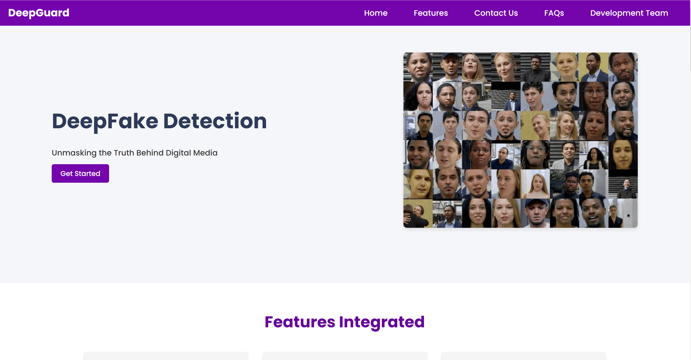

# DeepFake Detection Web Application

## Overview

This project is a web-based application for detecting deepfake images and videos using an ensemble of deep learning models. It provides a user-friendly interface for uploading media files, processes them using state-of-the-art deepfake detection algorithms, and presents the results with detailed analysis and visualizations.

## Features

- **File Upload**: Supports drag-and-drop or button-click file upload for images and videos.
- **DeepFake Detection**: Utilizes an ensemble of EfficientNet-B7 models for robust deepfake detection.
- **Detailed Analysis**: Provides a comprehensive report on the authenticity of the uploaded media.
- **Visualization**: Includes donut charts for overall confidence and bar charts for specific metrics.
- **Responsive Design**: Works seamlessly on desktop and mobile devices.
- **Dark/Light Mode**: Supports theme switching for user preference.

## Project Images

